# 2. Physical Layer

**Introduction**
- the last layer that adds functionality
- provides functionality to data link layer (one up)
	- converts bits to signals/ signals to bits
- deals with 
	- topology (mesh, hub, bus, ring)
	- hardware(repeaters, hubs, cables, waves, connectors etc)
	- encoding	
		- analog to digital, digital to digital etc.
	- transmission mode (simplex, half duplex, full duplex)
	- multiplexing 
		- converting n channels to fit one physical medium
		- dividing frequencies wrt time, wavelength


**Topology**


- types
	- Mesh
		- point to point communication (lan)
		- every device connected to every other
		- ports : hole to connect incoming wire
		- highest reliability
		- high security : high as no third device in b/w
		- cost is high : lots of wires, nC2
		- maintainance is high
	- Star/Hub
		- point to point commuincation
		- there is a central device(hub, multiport device)
			- devices connected thru hub
		- cable : n
		- reliability is low : single point of failure, hub
		- cost : lower than mesh
		- security : hub doesn't rat
	- Bus 
		- there is thick ethernet/backbone cable
			- devices connected to bus with drop wire thru tap
			- cables : n+1
		- reliability : low,single point or failure : bus wire
		- security : low, as middle cable can also tap
		- cost : cheaper than mesh
		- it uses
			- repeater (strengthens signal)
		- multipoint
			- so collision can take place
	- Ring 
		- joining ends of bus topology
		- uses token	
			- when toke recieved by a device, it can transmit data and/else pass it to next device
	- Hybrid
		- yes


**Signal Analysis**
- all composite signals is combination of sine waves with diff freq, ampl, phases

- distirbance in signal
	- Attenuation (loss in amplitude)
		
		- dB = 10lob<sub>10</sub>(P2/P1) //value -ve, atten. is +ve
		
		- example
			- 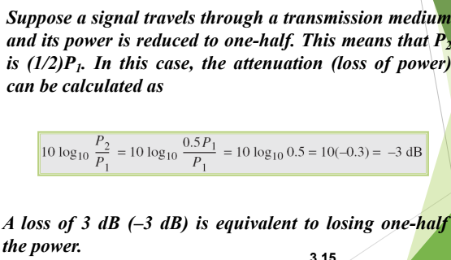
	- Distortion(bad shape of signal)
	- Noise
		- unwanted signal combined
		```
		SNR = (ave. signal power) / (ave. noise power) // greater the better
		```
		- SNR<sub>db</sub> = 10 log<sub>10</sub>SNR
		
		

- Data Rate Limits
	- is limited by (bandwidth, signalLevel, noiseLevel)
	- Noiseless Channel (Nyquist bitrate)
		- BitRate = 2 * bandwidth * log<sub>2</sub>(Levels)
			- example
				- 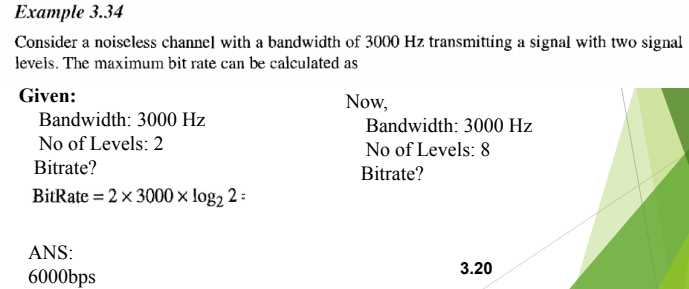
	- Noisy Channel (Shannon capacity)
		- capacity = bandwidth * log<sub>2</sub>(1+SNR)
			- example
				- 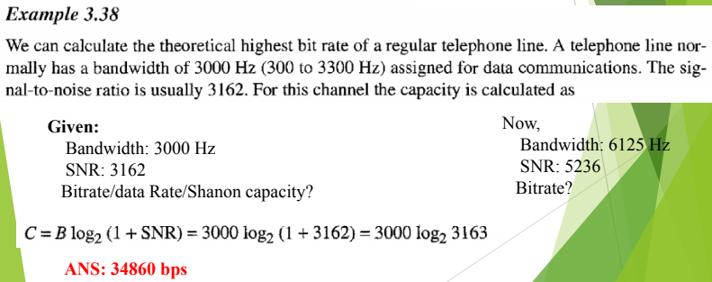


- Performance
	- bandwith(hertz, bps)
	- throughput (signal speed)
		- example
			- 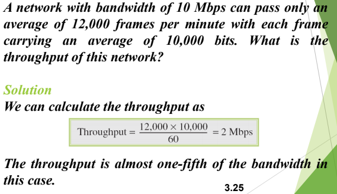
	- Delay
		- Latency = propogation time + transmission time + queue time + processing delay
			- propogation time : dis/time
			- transmission time: msg size/bandwidth
	- Bandwidth Delay Product
		- the no. of bits sent, after which first bit recieved


**Digital to Digital Conversion**
- introductin
	- data element : smallest unit of data 
	- signal element : smallest unit of signal
	- data rate & signal rate
		```
		noOfSignalElem = caseFactor * dataRate * (1 / dataElemToSigElemRatio)
		S = (c * N) / r
		```
		- example
			- 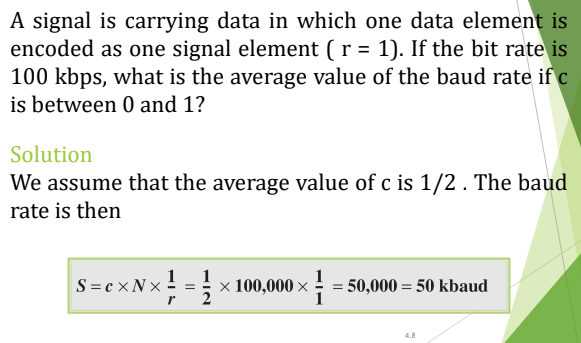


**Encoding Scheme**

- Encoding scheme characters
	- Baseline wandering (bad)
		- value is determiined by detecting incoming signal power against the baseline(running ave. of power), if long string of 0's or 1's, then baseline is wandered
	- DC component (bad)
		- long series of constant voltage
			- which creates low frequency
				- is problem for system can't pass low freq.
	- Self synchronization (good)
		- if clocks of sender and reciever not match, so that bits sent are interpreted wrong
		- example
			- for 0.1% faster clock of reciever, 
				- 1000 bits sent sent, 1001 bits recieved


	- Complexity (bad)
		- more costly than simple
		- example
			- four signal level is difficult to interpret than two
	- Built in error detection
	- Immunito to noise


- Line Coding Schemes
	- Unipoler (NRZ ) 
		- non return to zero (in b/w bit)
		- r=1
		- 0 V for 0, 1 V for 1
		- baseline wandering, dc component, synchronization problem
	- Polar 
		- NRZ-L (r=1)
			- -1 V for 1, 1 V for 0
			- problems as NRZ
		- NRZ-I (r=1)
			- if next bit 1, signal change
			- if next bit is 0 signal not change 
			- problems as NRZ
		- RZ
			- to solve NRZ, we return to zero mid bit, and 1V for 1, -1 V for 0
			- problem
				- more bandwidth, more complex
		- BiPhase
			- Manchester 
			- differential manchester
			- 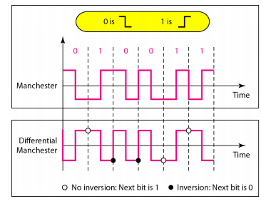
	- Bipolar (r=1)
		- AMI (alternate mark inversion)
		- pseudoternary (opp. of AMI)
		- 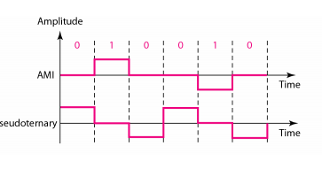
		- no dc component, no baseline wandering
	- Multilevel
		- 2B/1Q
			- 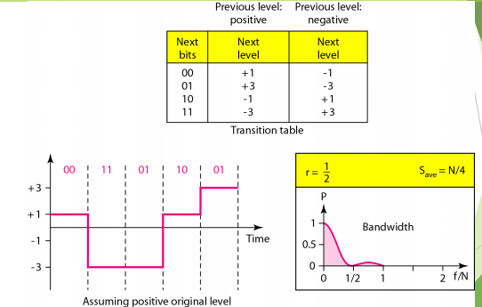
		- 8B/6Q
			- 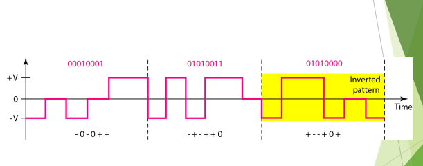
		- 4d-PAMS
			- 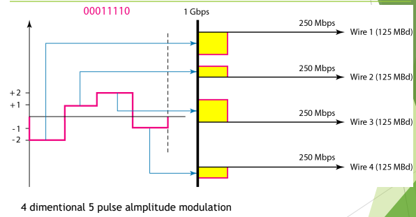
	- Multitransition
		- MLT-3
			- 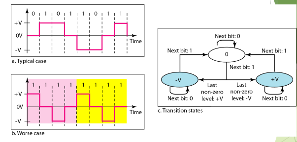


- Block Encoding Scheme
	- known as mB/nB, replaces m-bit group with n--bit group, we have some extra codes, which we use for control sequence like set, idle, reset etc


- Scrambling techniques
	- B8ZS
		- replaces 8 0's with 000VB0VB
		- V(Violation), is a non-zero voltage which means signal have same polarity as the previous non-zero voltage. Thus it is violation of general AMI technique.
		- B(Bipolar), also non-zero voltage level which is in accordance with the AMI rule (i.e.,opposite polarity from the previous non-zero voltage).
		- 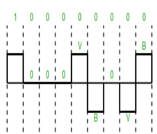

	- HDB3
		- 4 zeroes replaced with 000V or B00V
		- If the number of nonzero pulses after the last substitution is odd, the substitution pattern will be “000V”, this helps maintaining total number of nonzero pulses even.
		- If the number of nonzero pulses after the last substitution is even, the substitution pattern will be “B00V”. Hence even number of nonzero pulses is maintained again.
		- 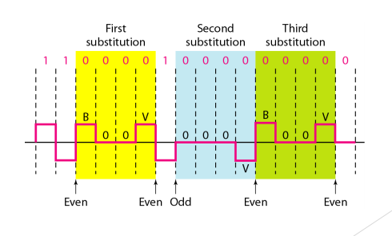


**Transmission Mode**
- data transmission
	- parallel (diff cable, concurrently)
	- serial
		- asynchronous
			- have parellel/serial converter
			- 0 as start bit, 1 as end bit
		- synchronous
			- we send 1 bit after another without start/stop bit
			- reciever should groups bits
		- isosynchronous


**Transmission Media**


- transmission media
	- guided(wired)
		- twisted pair cable
		- coaxial cable
		- fiber-optic cable
	- unguided(wireless)
		- free space

- wired
	- twisted pair cable
		- unshielded (UTP)
			- 10BaseT
				- 10Mbps
				- base means baseband(not broadband else collision)
				- T means 100m strength maintain(ethernet)
			- 100BaseT
				- 100Mbps
			- connector : RJ45
	- Coaxial cable
		- 10Base2
			- 2 means 200m
		- 10Base5
			- 5 means 500m
	- Fiber optics
		- 100BaseFx
			- 100Mbps
			- 2km


- unguided
	- radio waves (multicast comm. radio, tv)
	- microwaves (unicast such as cellular telephones, sattelite networks, wireless LAN)
	- infrared (short range communication in closed area, using line of sight propogation)


**Switching**

- switched networks
	- circuit switched networks
	- packet switched networks
		- datagram networks
		- virtual circuit networks
	- message switched networks


- circuit switching in telephone network
	- was made for telephone networks, where 
		- telephones of one city connected to an exchange
		- telephone exchanges connected to one another
		- 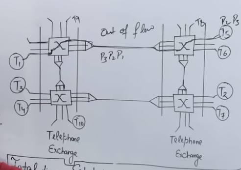
	- uses physical layer only
	- dedecated path is made, then contiguous data flows from source to dest.
	- no headers, we just need ot setup (reserve some bandwidth)
	- efficiency is less, even if we don't talk still we consume bandwidth
	- no dela, no hinderance
	- total time = setup time + TT + PT + TearDownTime
	


- Packet Switching
	- data is transmitted in packets
	- comes under data link and network layer
	- types
		- datagram (network layer)
		- virtual circuit (data link layer)
	- uses store and forward 
		- data packet sent to a switch(router)
		- switch(router) stores packet in buffer
		- now, it processes it(finds destination port in routing table) and forwards
	- delay is there due to store, process
	- pipeline is used (increases effieiency, decreases delay)
	- total time = TT(at each switch) + PT = n* TT + PT   //n is no. of switches visited


- datagram switching
	- 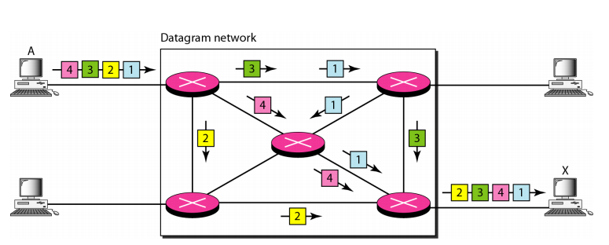
	- connectionless (packets travel independed to each other)
	- no reservation
	- out of order
	- high overhead due to header of each packet
	- more packet loss
	- used in internet
	- on demand, so 
		- cost is less
		- more efficiency, 
		- but delay is more


- virtual circuit switching
	- connection oriented
		- 1sp pkt continuous reservs switches(memory, buffer, cpu) till reaches dest
			- then upcoming follow same path
	- resernation
		- 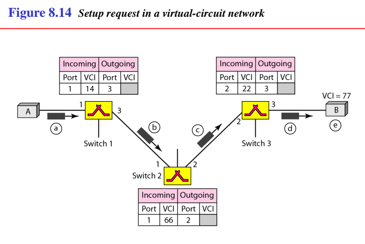
		- 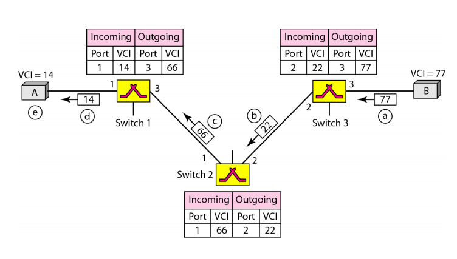
	- some order
	- less header overhead, only first packet contains global header
	- less packet loss
	- used in ATM(asynchronous transfer mode)
	- cost is more, as reservation is made, efficiency less, delay less


- message switching
	- predecessor of packet switching 	
	- used store and forward for first time
	- connectionless, hop to hop
	- no reservation


**Structure of Switches**

- circuit switch
	- 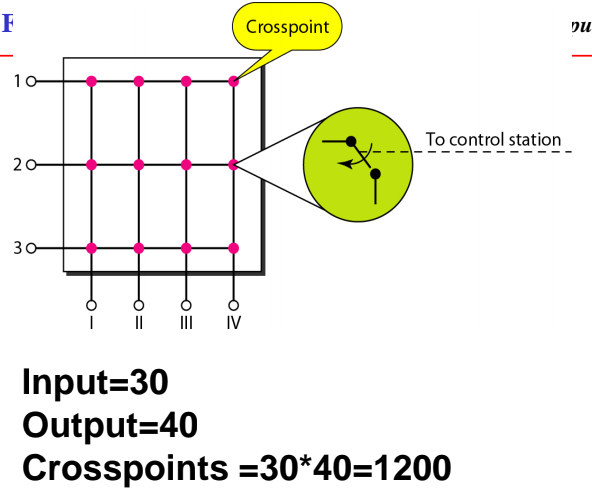
	- reducing cross point, we introduce one more stage, in between
		- 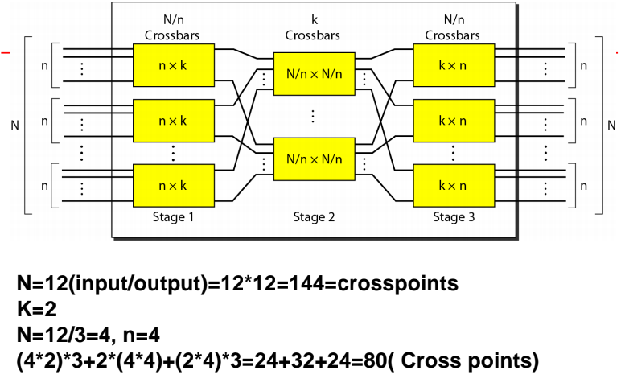
		- In a three-stage switch, the total number of crosspoints is 2kN + k(N/n)<sup>2</sup> which is much smaller than the number of crosspoints in a single-stage switch (N2).
		- 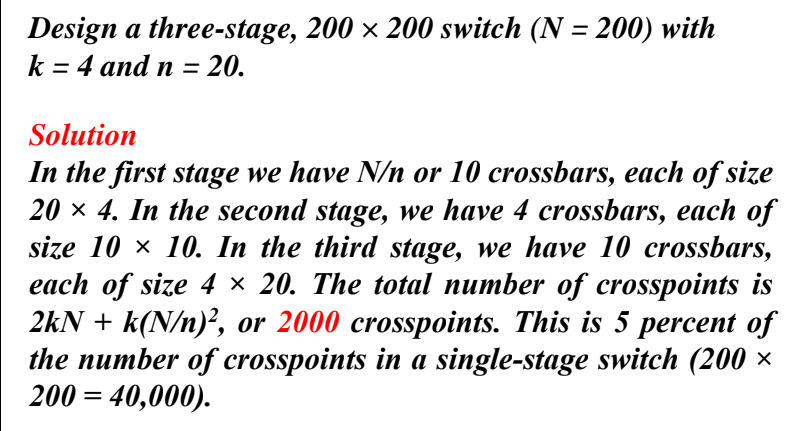
	- 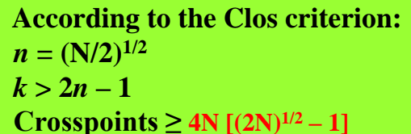
	- 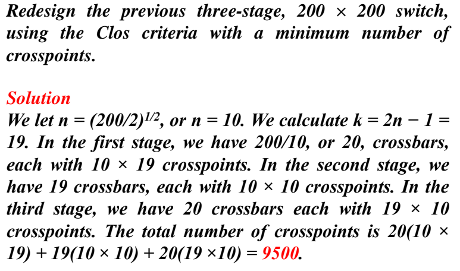
- packet switching
	- 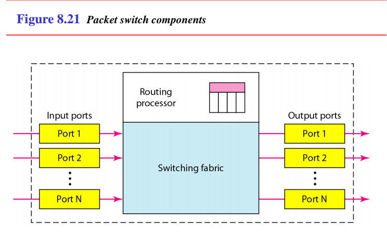
	- 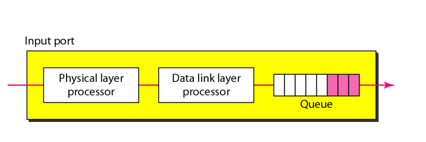
	- 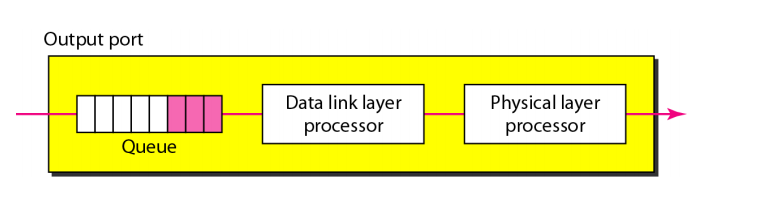