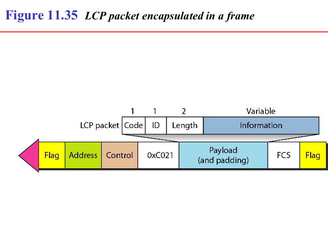
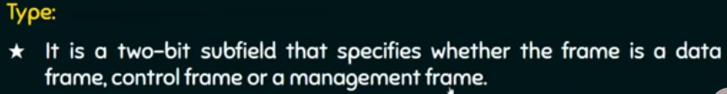

# 3. Data link Layer

**Introduction**
- Responsibility
	- takes data from network layer, provides to physical layer, which then sends it
	- within a network(lan), only data link layer is enough for communication
	- does hop to hop delivery or node to node delivery
	- does flow control (ARQ- automatic repeat request)
		- simplest (just keep sending)
		- stop n wait
		- go back n
		- selective repeat
	- does error control
		- crc
		- checksum
	- access control (to stop collision)
		- csma/cd
		- aloha
		- token ring/bus
	- uses physical address/ mac address/ nic card
	- creating frames out of packets (adds head & tails)


**Frames**
- 
- 


**Flow Control**
- Stop and Wait
	- 
	- keeps copy of sent packet
	- sends one frame and waits for acknowledgement, so takes lot of time
		- hence low efficiency
	- if no ack, after wait, sends again from memory
	- sender window size = 1
	- reciever window size = 1
	- efficiency = 1 / (1 + 2x)  = Tt / (Tt + 2 * Tp)
		- x = Tp/Tt
			- Tt = transmission delay = data / datarate
			- Tp = propogation delay = dis / time
	- retransmission (on error) = 1
	- Avai. Seq. No =  sender window size + reciever window size
	- examples
		- 


- Go back N
	- it is sliding window protocol
	- we send multiple frames 
		- and then wait for next ack
	- sender window size = 2<sup>k</sup> - 1
		- k = no. of bits to represent window 
		- window slides one or more slots, after valid ack recieved
	- reciever window size = 1
		- packets recieved in order
	- efficiency = (2<sup>k</sup> - 1) * (1 / (1 + 2 * x))
		- x = Tp/Tt
	- commulative acknoledgement
		- if 1,2,3 frames send so ack sends 4
	- retransmission = 2<sup>k</sup> - 1
		- lets say if first frame lost/corrupt
	- examples
		- 
		- 
		- 
		- Station A needs to send a message consisting of 9 packets to station B using a sliding window (window size 3) and go back n error control strategy. All packets are ready and immediately available for transmission. If every 5th packet that A transmits gets lost (but no ACKs from B ever get lost), then what is the number of packets that A will transmit for sending the message to B?
			- solution : 
				```
				pac1 -> 		//{1}
				<- ack2 			//window slides one slot
				pac2 -> 		//{2}
				<- ack3  		//window slides one slot
				pac3 -> 		//{3}
				<- ack4 			//window slides one slot
				pac4 -> 		//{4}
				<- ack5 			//window slides one slot
				
				pac5 -> X		//{5}
				pac6 ->			//{6} discarded
				pac7 ->			//{7} discarded
				
				pac5 ->			//{8} resent
				<- ack6 			//window slides one slot
				pac6 ->			//{9} resent
				<- ack7 			//window slides one slot
				
				pac7 -> X		//{10} resent
				pac8 ->			//{11} discarded
				pac9 ->			//{12} discarded
				
				pac7 ->			//{13} resent
				<- ack8 			//window slides one slot, creating 1 empty slot
				pac8 ->			//{14} resent5
				<- ack9 			//window slides one slot, creating 2 empty slots
				
				pac9 -> X		//{15} resent
				//wait
				//wait
				pac9 ->			//{16} resent
				<- ack10			//window slides to become empty
				
				
				//total frames sent = 16
				
				```
				
		- A 20 Kbps satellite link has a propagation delay of 400 ms. The transmitter employs the “go back n ARQ” scheme with n set to 10. Assuming that each frame is 100 bytes long, what is the maximum data rate possible?
			- solution : 
				```
				Tp = 400ms
				Tt = 100 * 8 / 20 * 1000 = 40 ms
				x = Tp/Tt = 10
				efficiency = N * (1/(1+2*x)) = 0.0476
				data rate = 20 kbps * efficiency = 952 bps 
				```

- Select Repeat
	- multiple frames like go back n
	- sender window = 2<sup>k - 1</sup>
		- k = no. of bits used to represent
	- reciever window size = 2<sup>k - 1</sup> 
		- k = no. of bits used to represent
	- accepts out of order packet
	- efficiency = (2<sup>k - 1</sup>) * (1 / (1 + 2 * x)) 
		- x = PT/TT
	- retransmission = 1
	- uses commulative, independent and negative ack (for error) 
	- searching and sorting is used, so a bit complex
	- example
		- 
			- thats why window must be 2<sup>m - 1</sup>
		- 


- HDLC
	- what
		- high-level data link control
		- bit oriented protocol (views framess as sequence of bits)
		- over point to point and multipoint
			- which uses above arq techniques
	- frame
		- 
			- i frame for information carrying (0)
			- s frame is supervisory frame, for flow and error control (10)
			- u is unnumbered frame, for miscellenius activities (11)
		- 
		- 
		- 
		- 
		- 


- Point to point protocol
	- what
		- most common for point to ponint
	- frame
		- 
		- PPP is a byte-oriented protocol using byte stuffing with the escape byte 01111101.
		- 
		- 
		- 
		- 
		- 
		- 
		- 
		- 
		- 
		- 
		- 
		- 
		- 


**Error Detection and Correction**
- Introduction
	- types of error
		- single bit error
		- burst error
	- detection methods
		- simple parity (even, odd)
		- 2d parity check
		- checksum
		- crc (cyclic redundancy check)
	- correction method
		- hamming code


- Hamming distance
	- the no. of 1 in xor of two binaries
	- for s bit error detection
		- min. hamming dis = s + 1
	- for t bit error correction
		- min. hamming dis = 2t + 1


- simple parity
	- least expensive
	- redundant bit = 1
	- even parity
		- keep no. of 1 even
		- if there is bit error
		- it turns out odd
		- so we detect there is error
		- tho, if (even) bits change, can't detect
		- min. hamming dis, d = 2	
			- so, we can detect upto d - 1 no. of error bits
	- similarly odd parity, for odd no. of 1's


- CRC (cyclic redundancy check)
	- can detect
		- burst error of length <= to polynomial degree
	- we have a polynomial divisor say x<sup>4</sup> + x<sup>3</sup> + 0 x<sup>2</sup>+ 0 x + 1
		- we convert it to binary as : 11001
	- now, to send messege of len = m
		- we append 0s equal to max power(4 here) at end of message
		- then we xor divide this with our divisor binary, 
		- we append last 4 bits of remainder to message and send (redundant, r = 4)
	- to recieve and detect error
		- we xor divide the message, with our divisor binary and if we get 0 as remainder no error, else single, odd or burst(len=4) error
	- efficiency = m/(m+r)

	- example
		- code was : 1010101010
		- divisor binary is
			- x<sup>4</sup> + x<sup>3</sup> + 1
			- or 11001
		- 
		- code becomes 1010101010 0010


	- 
	- 

- Hamming Code
	- if m is len of message
	- m + r = 2<sup>hamDis</sup> - 1
		- if hamDis = 3
			- we can detect 2 bit, correct 1 bit
	- we put parity at 2<sup>n</sup> for n : 0..log2m
	- lets say, m = 4
	- so our code d0 d1 d2 d3 becomes, p0 p1 d0 p2 d1 d2 d3   ....(1)
	- calculating parity bit 
		- p0 = d0 ^ d1 ^ d3 (at 1st pos, so pick 1 leave 1 ..from eq.(1))
		- p1 = d0 ^ d2 ^ d3 (at 2nd pos, so pick 2, 3 leave 4, 5..)
		- p2 = d1 ^ d2 ^ d3 (at 4th pos, so pick 4, 5, 6, 7 leave 8, 9, 10, 11 ..)
	- correction
		- e0 = p0 ^ d0 ^ d1 ^ d3
		- e1 = p1 ^ d0 ^ d2 ^ d3
		- e2 = p2 ^ d1 ^ d2 ^ d3
		- now, there is error at e2e1e0 th bit, e.g. 
			- 001 means error at 1st bit
			- 000 means no error
	- now, our code can also be d0 d1 d2 d3 p0 p1 p2, as now we know what the parity is.. so we can put it anywhere, but during error correction, we got to put it back to eq. (1)


- checksum
	- steps
		- the messege is divided in m bit units
		- now one more m bit unit is addes at end of message, called checksum
		- now message is sent
		- now when message recieved
		- the reciever sums all the m bit units
		- if sum is 0, then it is okay, else message is discarded

	- more specific steps
		- we add all the m-bit numbers using 1's complement arithmatic
		- meaning, if sum > m-bit, we add overflow bit to the sum
		- now we add the complement of above number at end of message
		- now when reciever adds all numbers, and complements, he should get 0
		- 
- in internet we use 16 bit checksum


- data link layer
	- local link control (error and flow control)
	- medium access control (mac)
	


**Multiple / Medium Access control (MAC)**
- if multiple devices in a bus, to control collision
	- random access protocol (device take no permission, any can send data, however much)
		- aloha (pure / slotted)
		- CSMA
		- CSMA/CA, CSMA/CD
	- control access (first decide who is going to send)
		- reservation
		- polling
		- token passing
	- channelization protocols (all send without collision)
		- FDMA
		- TDMA
		- CDMA


- pure aloha
	- 
	- we will transmit data as soon as we need
	- collision can occur
	- ack is send once data recieved, 
		- if data collide sender waits, no ack so retransmission
			- retransmission takes place after Tp * random(0..2<sup>KthRetry</sup>)
	- used in lan based networks
		- so no propogation time(almost 0), only transmission time, fixed for all
	- vulnerable time
		- is 2 * Transmission Time
			- during A is transmitting, if B starts transmitting then A & B collide
			- if C is transmitting, A starts then they collide
			- so no device should have been transmitting for 1 Tt before
			- and no should transmit for 1 Tt after
	- efficiency/throughput
		- G * e <sup>-2G</sup>
			- G = no. of packets trying to transmit at one Tt slot
			- is max when G = 1/2, efficiency is 0.184

			- G = no. of stations * no. of frames per station per second * transmission time of a frame
	- 
	- example
		- 


- slotted aloha
	- we divide timeline into slots = Tt
		- now any device can start transmission, at beginning of a slot
		- here collision take place if multiple device transmit at begin of a slot
	- vulnarable time = Tt
	- efficiency / throughput
		- G * e<sup>-G</sup>
			- max at G = 1
			- is 0.367
	- example
		- 


- Carrier Sense Multiple Access (CSMA)
	- we sense the channel through tap, if any transmission is there
	- types
		- 1 - prsistant
			- device keep sensing the tap, if no transmission, and want to send, then send
			- but if multple devices sense free, they all start transmission, then collide
			- ethernet uses this
		- 0- prsistant
			- if want to send, senses tap, if busy, waits random time
			- collision is less, as diff. device have diff. waiting
		- p - prsistant
			- continuously checks, but if free, there is p probability of device will transmit, or wait
			- wifi uses this
	- vulnerable time = propogation time


- CSMA / CD (collision detection in case of wired)
	- can't send ack, as collision will further increase
	- detection method
		- packet will travel Tp time and just before reaching destination, it collides
		- so now the collision signals goes all the way back in Tp seconds 
		- now as the energy in the line is more than sent energy, so collision is detected
	- Tt > 2Tp
		- it takes upto 2 Tp to detect collision, so upto that point we need to be still sending to detect incoming signal
	- throughput	
		- 1 / (1 + 6.44x)
			- x = Tp / Tt
	- 
	- example
		- 
		- 


- CSMA / CA
	- collision avaoidance
	- used in wlan(wifi)
	- can't detect double energy as energy is lost in air, so can't detect with CSMA / CD
	- 


- control access (station consults one another to decide which station should send)
	- reservation
	- polling
	- token passing


- Reservation
	- there are two time slots
		- reservation slots
			- divided into n mini slots
				- n is no. of stations
			- i<sup>th</sup> station can send a bit at i<sup>th</sup> slot to reserve.
		- variable data transfer slot
			- after reservation, every station knows that who has made reservation
			- so now in order of reservation, data is sent in data transfer slots
			- as everyone knows when who will send, there is no collision at all
	- 


- polling
	- a controller system grants access to devices, one by one
	- poll signal
		- controller sends poll to diff dev.
		- if device want to send, it sends & recieves ack
		- if dont want to send, device returns poll reject(NAK)
	- sel signal
		- if controller want to send data, sends sel
		- if recieve ack send data, recieve ack

	- 


- token - passing
	- whoever has token can send
	- token is circulated within devices
	- token management ensures non dissappearance of token, and time limit of token


- channelization protocols
	- FDMA (frequency division multiple access)
		- available bandwidth of common channel divided into bands, seperated by guard bands
	- TDMA (time ..)
		- one bandwidth is time shared
	- CDMA	(code ..)
		
- CDMA	
	- one channel carries all transmission simultaneously
	- working
		- each station is assigned a code, sequence no. called chips
			- each sequence no. has N elements, N = no. of stations
			- if we dot product diff. sequences and add, we get 0
		- if station 
			- wants to send 0, it is encoded as -1
			- wants to send 1, it is encoded as +1
			- doesn't want to send, encoded as 0
		- now, we multiply each encoded message with their sequence, and add all and send
			- 
		- now, on recieving, to get data of ith station we dot product with its sequence, and add all sequence bits and divide by N.
			- 


	- generating sequence code
		- we use walsh table for this
		- 


**Ethernet**
- IEEE Standerd
	- project 802 was started to enable intercommunication among equipment from variety of manufacturers
		- a way of specifying functions of physical layer and data link layer of major LAN protocols
- what
	- ethernet is a data link layer protocol
		- based on LAN
		- uses csma/cd
		- uses bus topology  
		- bitrate 1 mbps to 400 gbps
- ethernet evolution
	- standard (10 mbps)
	- fast (100 mbps)
	- gigabit (1 gbps)
	- ten-gigabit (10 gbps)
- ethernet frame format
	- 802.3 mac frame
		- 

		- preemble & sfd (7B + 1B)
			- added in physical layer
			- preembel
				- 56 bit 1010101....01 (for sync & alert)
			- sdf
				- 10101011 (synchronization & alert)
		- DA (6B)
			- mac address of next hop, found by ip
			- example 
				- 06:01:02:01:2C:4B
		- SA (6B)
			- mac address of this hop
		- length (of frame) (2B)
			- can be 0 to 2<sup>16</sup>-1 
		- data
			- atleast 46 byte, so that csma/cd can detect collision
				- min. size of frame needs to be (46 + 18) 64 B
				- 18 B is rest of the data
			- max can be 1500 B 
				- max size of frame (1500 + 18) 1518 B
		- CRC (4B)
			- cyclic redundancy check


- unicast and multicast address
	- defined by least significant bit of first byte 
	- if 0
		- unicast
	- else if 1
		- multicast
	- else if all bits 1
		- broadcast

	- example
		- 
		- a frame is there and its source address has first byte as FF, what is wrong with it?
			- a source address can never be multicast, because it is always unicast (originates from a single source)


**WiFi (Wireless Fidelity)**
- Introduciton
	- IEEE 802.11
	- like ethernet for small area
	- challenge:mediate access
	- supports
		- power management
		- sequrity mechanism
	- device connect with wifi access point, which is connected to powerOverEthernet, which is connected to router thru wire
	- uses 5 GHz radio band, has 23 overlapping channels
		- can use 2.4 GHz which has three non overlapping channel
	- uses CSMA/CA
	- modes of wifi
		- infrastructure mode
			- devices connect to access point (centralised) to connect to another device, infrasture
		- ad hoc & wifi direct
			- no infrastructure

	- wifi protocols
		- 


- Distribution system
	- 802.11 suitable for ad-hoc configuration, that may or may not be able to connect to all other nodes
		- 
	- scanning
		- nodes (device) select access point with this
		- a mobile node sends a probe frame
		- all APs within reach reply with probe response frame
		- node selects one of access point and sends that AP an association request frame
		- the AP replies with association response frame
	- active scanning
		- mobile nodes continuous sending probe frames, to find what all APs are there, and connect to better one
	- passive scanning
		- APs send Beacon frame periodically to tell its capability

- 802.11 wifi frame format
	- 
	- 
		- 
		- 
		- 
		- 
		- 
		- 
		- 
		- 
		- 
		- 
		- 
	- 
	- 
	- 
	- 
- hidden terminal problem
	- when A & B share AP1, B & C share AP2, now they both(A & C) send frame to B not seeing each other, and collision occurs
	- solution 
		- use cts and rts (mac algo)
			- sender sensd rts (request to send) & len of data, it goes to all nodes, to hold medium
			- reciever replies with cts(clear to send)
			- if any node sees cts, won't transmit
			- if node sees rts only, will know it wont effect so can transmit


**Bluetooth**

- IEEE 802.15.1
	- 
	- 
	- 
	- 
	- 


**Virtual LAN (VLAN)**
- 
- 
- 
- 
- 
- 


