# 4. Network Layer

**Introduction**
- responsibility
	- takes data from transport layer and passes to data link layer
	- host to host delivery (source to dest delivery)
	- uses logical address (ip addr)
		- tells about network and host
	- routing(router decides where packet goes)
		- RIP
		- OSPF
	- fragmentation
		- to divide packets
	- congession control

- network layer services
	- packetizing
		- gets payload from transport layer, adds header containing source & destination addresses
		- can't change content unless too large and needs fragmentation, and then reassembling them at destination
		- nobody changes the address of packets, routers can only read it
	- routing
		- a physical network is combination of networks (LANs and WANs) and routes that connect them
		- network layer finds best route, by routing protocols
	- forwarding
		- routing table created  by routing protocol is also called forwarding table, because it needs to forward packet based on it.

***

**Hardware**
- repeaters (joins two cables and regenerates signal strength)
- hub
	- for star topology
	- just forwards/broadcasts/no filtering
	- collision possible
- bridges
	- used to connect two topologies(LANs)
	- forwards, acc. to filtering mac addr. as this work in data link layer
	- types
		- static
			- maintable table of mac & port of bridge
		- dynamic
			- if entry not in table
				- saves source mac & port
				- broadcasts packet to all ports
				- now, recieving mac responses
				- now, bridge saves destination mac
	- collision ?
		- no collision
			- store and forward technique	
	- solves loop by using min spanning tree

- routers
	- used in wan (physical, datalink(mac addr), network layer(ip addr))
	- has routing table to check, forward to address, if !found, flood all ports
	- no collision, uses store and forward method

- gateways
	- located at boundary of network
	- manages all data inflow and outflow
	- forms passage b/w two diff. networks operating with diff. transmission protocol
	- operates as protocol converter, providing compatibility
	- can operate at any layer of OSI model

***

**IPV4 Addresses**
- property
	- address is of 32 bit, 8 bit * 4
	- dotted decimal notation
- classfull addressing ()
	- class A
	- class B
	- class C
	- class D
	- class E
- classless addressing
	

- class A addressing
	- 1st bit in first octave is 0 (prefix)
	- remaining bits = 31
		- total ip addresses in class A = 231  //50%
	- range of networks : 0.x.x.x .. 127.x.x.x
	- no. of networks in Cl.A = 27 = 128
		- 0000000 & 1111111 is not used by any network, so remaing = 126
	- no. of host in a net in Cl.A = 224
		- x.0.0.0(represents network) & x.255.255.255(directed broadcast address) is reserved, so #ofhosts = 224 - 2
	- default mask = 255.0.0.0
		- to find network of a host, we AND it with default mask

- class B addressing
	- first two bit of first octad is 10
	- remaning bit = 30
		- total ip addresses in class B = 230	//25%
	- range of networks : 128.x.x.x - 191.x.x.x
	- no. of networks (first two octads tell network)
		- 6 + 8 = 14 bits, so = 214 = 17894
	- no. of hosts in each network = 216 = 65534
		- usable = 216 - 2 (removing network ip and direct broadcast address)
	- default mask : 255.255.0.0

- class C addressing
	- first three bits of first octad is 110
	- remaining bits = 29 bits
		- total ip addresses in class B = 229	//12.5%
	- range of networks : 192.x.x.x - 223.x.x.x
	- no. of networks (first three octads tell network)
		- 5 + 8 + 8  = 21 bits, so = 221
	- no. of hosts in each network = 28 = 256
		- usable = 256 - 2 = 254 (removing network ip and direct broadcast address)

- class D addressing
	- first four bits of 1st octad = 1110
	- range of network = 224 - 239
	- no. of ip address = 228	//6.26%
	- no network and host alloted as, group email/ broadcast

- class E addressing
	- first four bits of 1st octad = 1111
	- range of netwrok = 240 - 255
	- no. of ip address = 228	
	- reserved for millitary purpose

- disadvantage of classful address
	- wastage of IP address
	- maintainance is time comsuming in large networks
	- more prone to errors
	- security problem

**Classless addressing (CIDR)**
- no classes
- only blocks
	- [ [ Block ID ] [ Host ID ] ]
- notation
	- x.y.z.w/n 
		- n is mask, no. of bits used to represent network id & host id
			- 200.10.20.40/28
				- here 28 bits represent block/network, 4 host
				- 200.10.20.0010 1000
					- so network id = 200.10.20.00100000 = 200.10.20.64/28
- rules
	- addresses should be contiguous
	- no. of addresses in a block must be power of 2
	- first address of every block(network addr.) must be evenly divisible of size of block

**Subnetting**
- what
	- dividing large networks into smaller ones, for better organization
	- example
		- if we have network 200.10.20.0 (class C, 254 hosts) 
			- 200.10.20.0 000 0000 & 200.10.20.1 000 0000 are two subnets
				- 200.10.20.0 (subnet no.) to 200.10.20.127 (direct broadcast) (126 hosts)	subnet mask : 255.255.255.128
				- 200.10.20.128 (subnet.no) to 200.10.20.255 (direct broadcast) (126 hosts) subnet mask : 255.255.255.128
	- disadvantage
		- we got to check subnet id also

- variable length subnet masking (VLSM)
	- divide 200.10.20.0 in 50%, 25% & 25%
	- so, first we have
		- 200.10.20.0/25 (upto 200.10.20.0111 11111) or (200.10.20.0 to 200.10.20.127) (usable : 126)
	- next, we have
		- 200.10.20.1000 0000/25 
		- which we will again divide 
		- we have
			- 200.10.20.1000 0000/26 (upto 200.10.20.1011 111) or (200.10.20.128 to 200.10.20.191) (usable : 62)
		- and
			- 200.10.20.1100 0000/26 (upto 200.10.20.1111 1111) or (200.10.20.192 to 200.10.20.255) (usable : 62)

	- to check network ID of an ip just AND it with the subnet mask

**Special addresses**
- host address
	- 0.0.0.0/32
		- when host doesn't know its source address
- limited broadcast address
	- 255.255.255.255/32
		- broadcast inside a network
- loopback address
	- 127.0.0.0/8
		- never leaves the host
- private address
	- 10.0.0.0/8
	- 172.16.0.0/12
	- 192.168.0.0/16
	- 169.245.0.0/16
		- used in NAT
- multicast
	- 224.0.0.0/4

**Network Address Translation/Resolution (NAT)**
- suppose a network has been assigned only one universal ip, 
- now this network creates its own private netwrok and give them private ip's
- now when a device sends packet, with its private source address
- at the NAT router, its source address is swapped with router's universal address, but private port is not changed with router's port
- at this time, in the NAT table an entry is made, with private ip, private port, destination address, port
- now when a response comes from the destination addres, to the private port, the NAT software checks the NAT table, and forwards the packet to the device
- 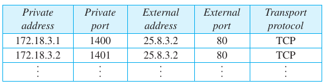

**Address Resolution Protocol (ARP)**
- what
	- here, communication is done with the help of mac address
- how
	- so if A wants to communicate with B, so it needs to know its mac address, but knows just ip addr
	- so it sends a header with its mac address, its ip address, dest ip address and fills FFFFFF in dest mac
	- this header broadcasts in the network, and when the dest ip gets the message, it replies with its mac address
	- now A saves mac of B, for future reference
- header
	- 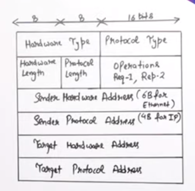
	- fields
		- h/w type
			- ethernet has 1
		- protocol
			- 0800 (ipv4)
		- h/w len (mac addr len) (6 bit to represent 6 byte)
		- protocol length (4 here)
		- operations
			- req - 1
			- res - 2
		- sender hw addr
		- sender prot. addr
		- target hw addr
		- target prot. addr

**Packet forwarding**
- there is forwarding/routing table in routers, where they store network address with  mask, with longest mask first(more specific addresses), next-hop address, and interface no
- now, when a packet comes with a dest address, it is matched with the network address in the routingg table, if it matahes, then it is forwarded in the appropriate interface, else if no match, then it is forwarded to a default port where the routing table might know the address
- we reduce routing table size by 
	- address aggregation
		- a city center will only direct to appropriate street acc. to dest address, next the street center will have house address
	- heirarchial routing
		- we have ISPs at country, region, and local level
		- now each ISP does it's own subnetting with mask higher than its upper level, and any router outsize a heirarchy just needs to know the root
		- so packets are routed more easily
	- geographical routing
		- one country router has only one entry for the country isp of another country

**IPv4 Protocol**
- what
	- is a connectionless protocol
		- it is a datagram service (datagram can follow any route)

- IPv4 header
	- it is an envolop for an ipv packet
	- 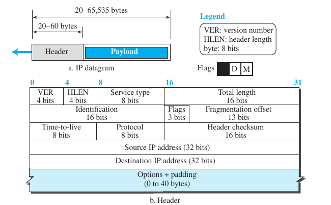
	- packet size : 64 KB
		- header
			- there are 12 important fields and 1 optional fields, with 20-60 bytes
		- payload of can aquire remaining address
	- fields
		- version (4 bit)
			- 0100 (4)
		- HLEN (4 bit)
			- header length (to detect payload)
			- value * 4 to get real header size(so values can't be 0,1,2,3,4 because min. size is 5*4 = 20)
		- Service Type (8 bit)  or dscp
			- type of service (TOS)
				- p p p d t r c 0 (differentiated services code point (dscp))
					- p : precedence
					- d : delay (if want no delay, 1)
					- t : throughput (to max throughput, 1)
					- r : reliability (if want reliability, 1)
					- c : cost (to reduce cost, 1)
					- 0 : for future
			- diffServ
				- 6 bit for dscp, 2 for congession control
		- total length (16 bit)
		- identification (16 bit)
		- flag (3 bit)
		- fragment offset (13 bit)
		- TTL (time to live) (8 bit) (max 255 hops)
		- protocol (8 bit) (mention if any higher level protocol)
		- header checksum
		- Source IP address (32 bit)
		- Destination ip address (32)
		- options and padding

- IPv4 fragmentation
	-  in header
		-  Identification bit (16 bit)
			-  all fragments have same id. no.
		-  flag (3 bits)
			-  res. (not used)
			-  DF (do not fragment, 1 if should not fragment)
			-  MF (more fragments comming, then 1)
		-  fragment offset (13 bits)
			-  relative position of data (divided by 8)
	-  example
		-  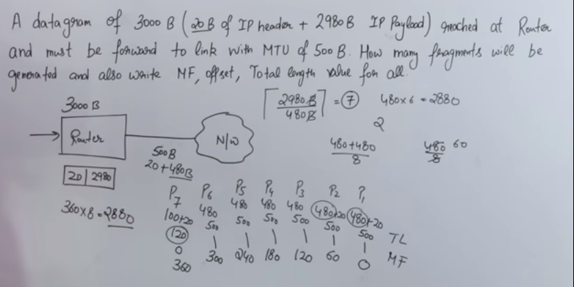

- Internet Control Message Protocol v.4 (ICMPv4)
	- need
		- for exchanging messages in network layer
		- this message is sent in the IP datagram directly, with version set to 1
	- messages
		- types
			- error-reporting messages (report problems router/host may face)
			- query messages(host or network manager require specific info from router or another host)
	- header
		- 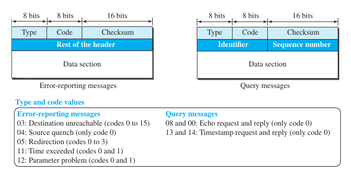
		- fields
			- type(type of message)
			- code (reason for message)
			- rest is specific
		- error message
			- dont send if/for 
				1. to multicast 
				2. error in another ICMP packet 
				3. for non first fragment
			- data section contains ip header of original datagram + first 8 bytes of data(UDP & TCP error handling)
		- query message
			- echo used to check liveliness
			- timestamp used to check roundtrip time
	- ping
		- we use ICMP for ping to check liveliness and roundtrip time..
		- 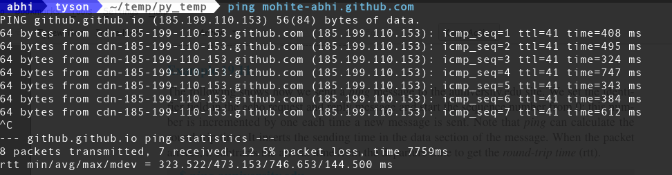
	- traceroute
		- it uses ICMP error message, destination not reachable
		- sends 1 to 30 messages incrementaly with intention to get not reachable at each hop
		- 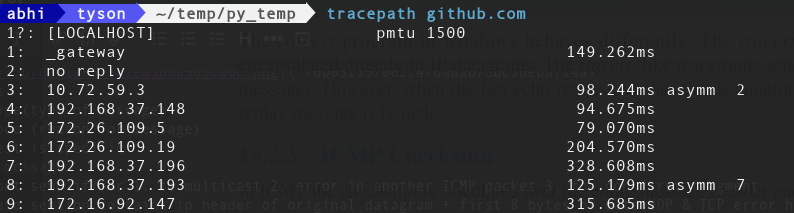

- Internet Group Management Protocol
	- used by multiple hosts and adjacent routers for multicast communication with ip networks
	- uses resources efficiently to reansmit the message packets
	- can have single/multiple sender/reciever
	- applications
		- streaming
		- gaming
		- web conferencing	

**IPv6 header**

- what
	- 2128 addresses
	- made header shorter
- header
	- 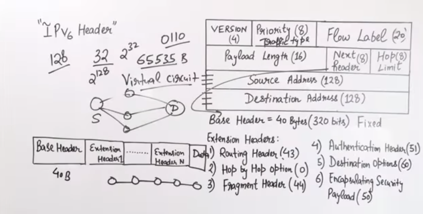
	- base header = 40 Bytes fixed, we can have extention header
	- fields
		- version (4 bit)
			- 0110 (6)
		- priority (8 bit)
			- conjestion control
		- flow label (16 bit)
			- for realtime data, for virtual circuit, to follow one path
		- payload length (16 bit) (althouth we can send 4 gb data)
		- next header, more headers
			- routing headers (43) : sender decides router
			- hop by hop option (0) : to give info to hops
			- fragmentation header (44) : to help with fragmentation, only by source
			- authentication header (51) : for login
			- destination header (60) : only dest can open
			- encapsulation security payload (50) : encryption info
		- hop limit
		- source address (128 bit)
		- destination address (128 bit)

**Routing**
- what
	- the formation of routing tables at routers 
		- for the forwarding of packets 
		- from the source router to the dest router
	- we use only heirarchial routing for this
	- we use least cost routing, and create least cost tree, similar to a min. spanning tree
	- so we dynamically create the routing tables
- Routing Algorithms
	- types
		- intra domain (routing inside an autonomous system)
			- distance vector (RIP)
			- link state (OSPF)
		- inter domain (routing b/w two autonomous systems)
			- path vector (BGP)

	- Distance Vector Routing (DVR)
		- all router has a routing table with entries of all dest. routers, including itself
			- now, we fill distance of our neighbouring routers at step 1
			- at all next steps, we take entries of of other's neighbour from their tables
		- step 1
			- 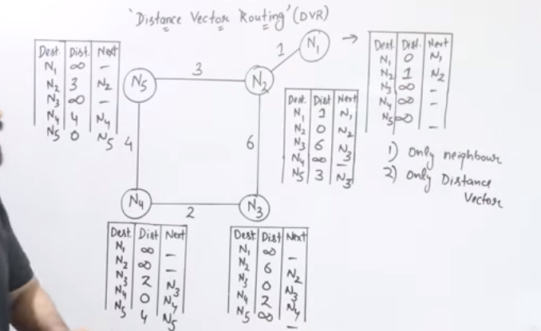
		- step  2 (for N1)
			- 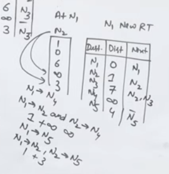
		- step 2 (for N5)
			- 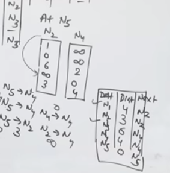
		- count to infinity problem
			- if a router is unreachable, this information moves very slow in the net
			- a similar problem to this is two node loop, when the router is not unreachable but goes further but this information gets lost, while sharing
				- 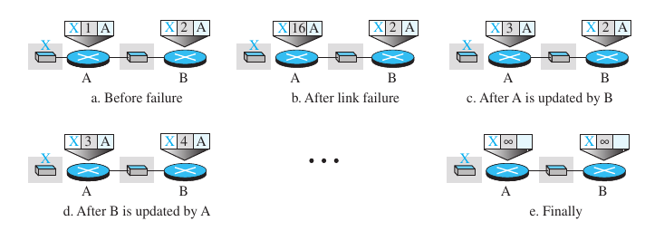
				- solution	
					- split horizon
						- B knows that best path of X is thru A, so it thinks no need to send info back to A
						- but if A for long doesn't hear about X, it thinks that X must be gone, so it removes it
					- Poison Reverse
						- here B sends the info but tells that it should not be used, so A doesn't and when A shares with B, now B also has new value
			- three node loop, these solutions might not work for three node loop
				- 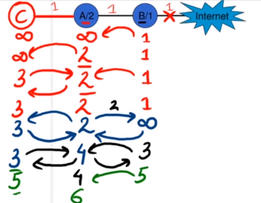

	- Link State Routing (LSR)
		- first, each router sends hello to neighbour and finds their distance
		- second, each router wraps this info in a  LS packet (LSP)
		- third, flooding, each router sends LSP to its neighbour, now whoever gets the info, if newest info, it further spreads except from where it came
		- in this way every one has all the info about all the routers, collected in LS Database (LSDB)
		- now, they use djikstras algo, to find the shortest path, and this is the path they need to send to 

	- Path Vector Routing (PVR)
		- it can have its packets route using a set of policies, that too efficiently, as not based on least cost
		- it is used to route packets bw ISPs
		- here first, second and third steps are same as LSR, though here we call the LSP's as Path Vectors
		- now, when everyone has all the path vectors, it creates its own spanning tree using the best(path(x,y), x+path(v,y)), where best chooses the one which best fits given policy
		- here, all routers will have different copy of spanning trees, acc. to their policies
		- 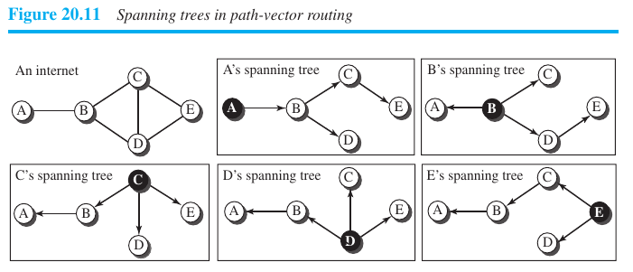

- Routing Protocols

	- Routing Information Protocol(RIP)
		- uses DVR
		- here cost is hops and instead of communicating with neighouring routers, it communicates with neighboring network routers
		- creates table like
			- 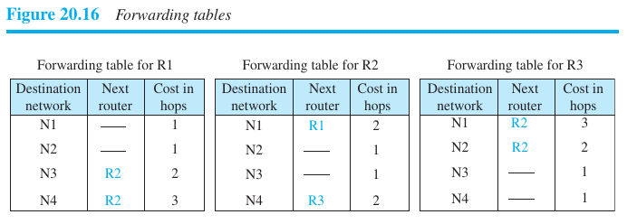
		- sends/requests entries of routing table with RIP messages (sends every 15 seconds)
			- 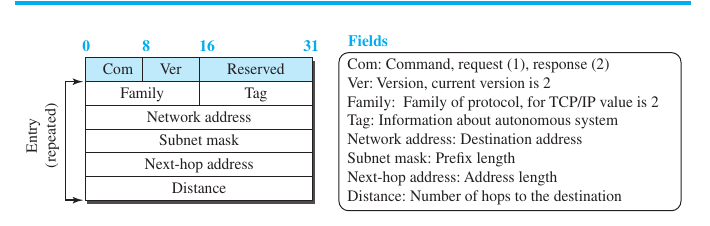

	- Open Shortest Path First (OSPF)
		- based on LSR
		- calculates from source router to destination router
		- cost is hops of source to destination, but we can also assign throughput, round trip time, reliability etc
		- rest all we can use LSR, djikstra
		- routing table same as RIP

	- Border Gateway Protocol ver.4 (BGP4)
		- based on PVR

