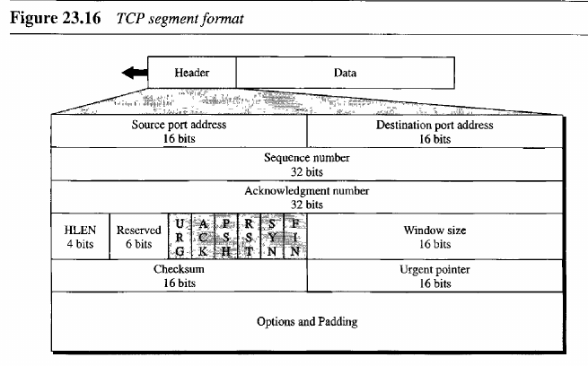
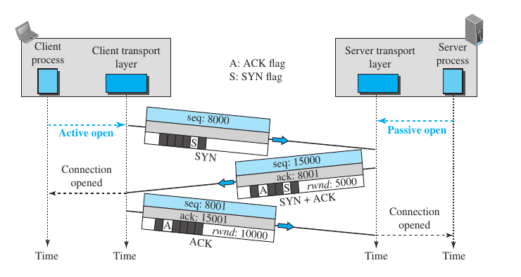
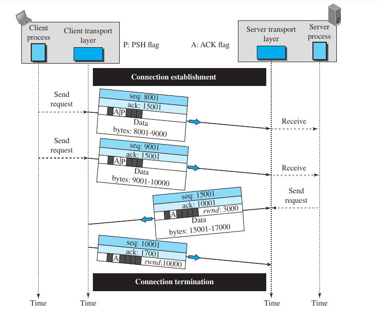
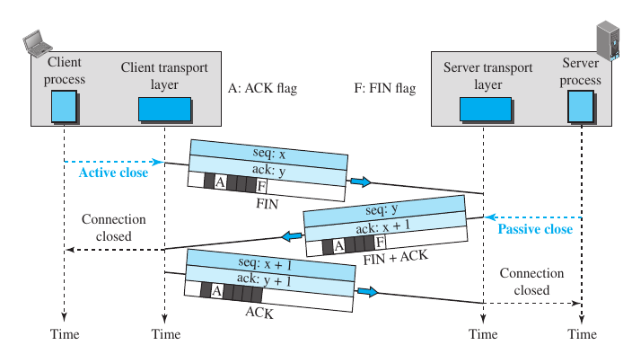
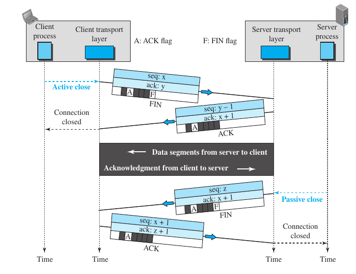
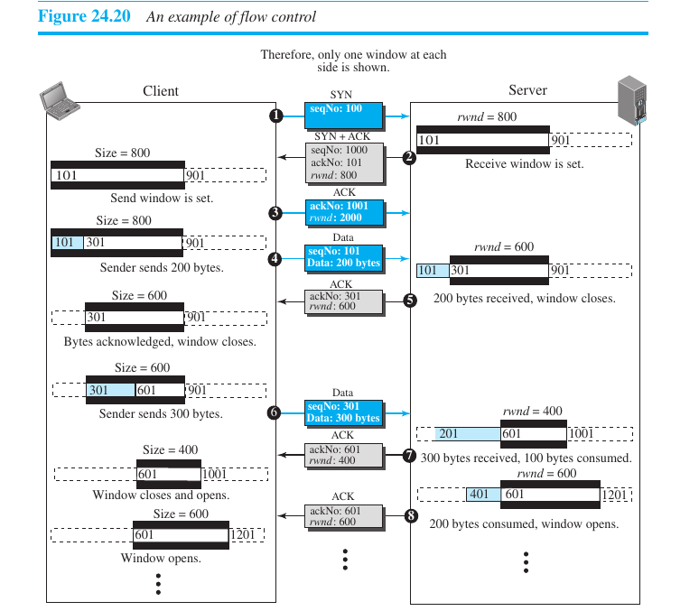

# 5. Transport Layer

**Introduction**
- takes data from application layer and passes to network layer
- Responsibility
	- end to end delivery (port to port delivery)
		- there are multiple applications running, which have port, so TL helps in communication bw them
		- uses
			- TCP
				- ip has unreliable, so we use this
				- ensures right number and order of packets
				- ensures no loss of data
				- is connection oriented
	- does error control with checksum
	- does conjesion control and flow control
	- segmentation, segments continuous data from above
	- multiplexing, demultiplexing (merges data by multiple applications)

**TCP (Transmission Control Protocol)**
- what
	- byte streaming protocol, continuous data from application layer, tcp makes segment that have bytes, from the continuous bits
	- for making ip connection oriented, we use tcp (reliability, 3-way-handshaking)
	- full duplex
	- piggybacking (sending data along with ack) (uses go back N, and selective repeat)
	- error control, flow control and congestion control
- segment header
	- 
	- size (20-60B)
	- fields
		- source port (16 bit)
		- destination port (16 bit)
			- 216 port numbers
			- 0-1023, well known ports
			- port no. given by device to application
			- the combination of ip address and port address is called socket address
		- sequence number (32 bit) (the no. assigned to first byte, if first segment, a random no. is given)
		- acknoledgement number (reciever sends next expected byte no.)
		- HLEN (4 bit) (similar to ip HLEN)
		- 6, 6 bit reserved for future
		- control (6 bit)
			- URG (urgent) (if URG==1 in first segment, then following segments are urgent upto to urgent pointer is reached, also given by first segment)
			- ACK (1 for telling header is acknoledgement)
			- PSH (we don't want the data to wait)
			- RST (reset, to reset connection)
			- SYN (for synchronization, for connection making)
			- FIN (for ending connection)
			- window size (16 bit) (sender/reciever tells window size)
		- checksum (16 bit)
		- urgent pointer (urgent bytes ending no.)
		- option and padding (40 Bytes)
			- max. segment size (MSS)

- TCP Connection
	- Connection establishment (3-way handshaking)
		- 
		- connection needs to be established b/w client and server
		- first way handshake 
			- client sends syn segment wit SYN=1, rand sequence no(ISN - init. seq. no, but 0 data bytes)
			- client is in active open state
		- second way handshake
			- server sends syn+ack segment with SYN=1, ACK=1, ack. no. = (client seq. no + 1), seq. no = ISN(no data)
			- sends its reciever window size, option(MSS - max segment size)
			- server is in passive open state
		- third way handshake
			- now, client sends ack segment with ACK=1, ack no.= (server seq no. + 1)
			- sends seq. no = (server ack. no) only if client want to start sending data, elso no seq. no is consumed
			- sends window size, option(MSS - max. segment size)
			- now, connection has been established, and data can be tansfered

	- Data transfer
		- 
		- first, connection is established by 3-way handshaking, buffer is established(resources are reserved)
		- now data can be sent both way simultaneously using piggybacking
		- piggybacking : sending data and ack together
		- next packet from client
			- now data is sent with ACK=1, ack no.=(serv. seq. no + bytes recieved + 1), seq no = (serv. ack. no.)
		-  next packet from server
			-  data is sent with ACK=1, ack.no=(cli.seq. no + bytes recieved + 1), seq. no=(cli. ack. no + 1)
		-  pure acknoledgement packet (no data/piggybacking)
			-  header is sent, with unused seq. no= (rec. ack. no), ack. no = (rec. seq. no + bytes recieved + 1)

	- Connection Termination
		- Three way
			- 
			- client sends fin segment, F=1(finish), A=1, with data or no data, seq. no=(rec. ack. no.), ack=(rec. seq. no+(bytes.rec)+1)
			- server sends fin+ack segment, F=1, A=1, seq. no=(rec. ack. no) with data or not, ack.no=(rec. seq. no.+(if data recieved)+1)
			- client finally sends ack segment, A=1, unused seq. no=(rec. ack. no), ack.no=(rec. seq. no+(if data recieved)+1)
			- now connection is fully terminated
		- Four way (half close)
			- 
			- client sends fin like three way
			- but server will need to send some data later, so it sends only ack segment A=1, seq. no=(rec.ack.no+1) with data or not, ack.no=(rec. seq. no.+(if data recieved)+1)
			- now there is a half close state where server can send data 
			- server sends data, client sends ack
			- then when server wants to finish, it sends fin segment, F=1, A=1, seq. no=(rec.ack.no+1) with/without data, ack.no=same as last. ack. no
			- finally client sends ack segment A=1, unused seq. no=(rec. ack. no), ack. no=(rec. seq. no+(if data rec)+1)

- TCP Control
	- Flow control
		- both tcp's have a window which closes(becomes small) or opens(becomes big) accordingly
			- a server window might close, when it has some bytes of segment data in window, and can not use it, so it will send reduced window size with next ack
			- a client might recieve a reduced window size, and will close it's own window, so that it should not send more data than that
		- example
			- 

	- Error Control (3 methods Chcksm, Ack, Retransmission)
		- Checksum 
			- if problem, in checksum field of segment, segment discarded
			- segment is shown as simply lost, so no ack returns
		- Acknoledgement
			- cumulative acknoledgement (just send the next. no. of segment that is needed irrespective of higher segments are recieved)
			- selective acknoledgement (SACK in options) (tells about a block of bytes that is out of order or duplicate)

		- Retransmission
			- when segment sent, it is stored in a queue, and a timer starts
				- when an ack arrives for it(requesting bytes next to it), it is removed from queue
				- if timer expires and no ack, it is resent, and only removed when ack comes
				- but if, 3 ack come which demand start byte of this segment, then it is immidietly sent without waiting for timer

	- Congestion control
		- what
			- conjestion doesn't happen at tcp end because of the closing of the window, but it does happen in between in the routers
			- although network layer or ip should be responsible for this, but it is irresponsible, so TCP has to man up and solve the clallange
		- how
			- TCP accelerates segment by increasing the conjestion window size, and deaccellerates by decreasing it
			- actual window size = min ( reciever window size [solves end conjestion], conjestion window size [solves middle conjestion])
		- Conjestion detection(two hints)
			- time-out : if no ACK recieved and time out occurs, tcp thinks definitely there must be conjestion
			- 3 duplicate ACKs : this tells that there might have been a conjestion, because now, 3 more segments have been transmitted 
		- Conjestion policies
			- Slow start algorithm
				- we start with cwnd(conjestion window) as 1 MSS(max.segment size decided), now for each ack recieved we increase cwnd by that many segments, this goes on exponentially until ssthresh (threshold) is reached in the sender
				- first cwnd size : 1 segment
				- then, 1 ack recieved, cwnd size : 2 segments 
				- then, 2 acks recieved, cwnd size : 4 segments 
				- ...
			- Conjestion Avoidance (additive increase)
				- after the ssthresh value is reached, for no. of ACKs equal to cwind recieved, the cwnd is increased by 1
			- fast recovery
				- after 3 duplicaate acks, cwnd is increased by 1 after every duplicate ACK
		- use of policeis (example)
			- a tcp sender alternates between these policies
				- like it starts with slow start, until thres(which is usually rwnd/2)
				- but if it faces a time out, then it resets cwind to 1 MSS and switches to conjestion avoidance
				- now, if it gets 3 ACKs, it thinks, 'oh, conjestion i there but not so hard', so it resets to 1 again switches to slow start

	- QoS (Quality of Service)
		- what
			- it is overall performance measure of computer network
		- Reliability
			- if packets are lost, reliability is low, we have to retransmit
		- Delay
			- delay in getting packets, if there is delay, we should make URG=1, or remove conjestion
		- Jitter
			- the variation in delay 
		- Bandwidth
			- video call need high bandwidth

**UDP (User Datagram Protocol)**
- what
	- connectionless protocol (datagram service)
	- is unreliable (drops packets)
	- is unordered

- segment
	- total length = 216
	- header len = 8 byte
	- max data len = 65527 B

- header
	- source port (16 bit)
	- destination port (16 bit)
	- length (16 bit)
	- checksum (optional) (16 bit)
		- udp header + udp data + pseudo header of IP

- advantages over TCP
	- query response protocol (one request one reply ex. DNS, DHCP )
	- speed but not reliability is priority
	- broadcasting/multicasting (RIP uses for flooding)
	- continuous streaming (youtube, meet)
	- stateless (like if not login, google need not maintain any user state for us)

- difference b/w tcp and udp
	<table><tr><td><b>TCP</b></td><td><b>UDP</b></td></tr><tr><td>Connection oriented</td><td>Connectionless</td></tr><tr><td>Reliable</td><td>Less reliable</td></tr><tr><td>Error control mandatory</td><td>Error control optional</td></tr><tr><td>Slow transmission</td><td>Fast transmission</td></tr><tr><td>More Overhead</td><td>Less Overhead</td></t><tr><td>Flow control, conjestion control</td><td>No flow, conjestion control</td></tr></table>

