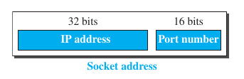

8. Application Layer

**Introduction**
- responsibilities
	- uses the functionalities/proptocols provided by Transport Layer (TCP/IP), and provides specialized services to the user like mail transfer, file transfer, hypertext transfer and thousands others 
	- types of protocols
		- standard(like ftp, http)
		- non standard (anybody can create and use privately)
	- two machines on internet can communicate with each other with the help of application layer using one of two paradigms
		- client server paradigm
		- peer to peer paradigm

- client server paradigm
	- server
		- an application program that provides services
	- client
		- the application program that uses server's services
	- server process
		- server process runs continuously waiting for client process, to make connection and ask for service
		- server processes provide a specific type of service
	- client process
		- the client process is started when client needs to recieve service
		- the client process can request service from any of the server provessesaa

	- examples
		- WWW, e-mail etc.
	- problems with client server paradigm
		- the load of communication is more on the server process, so the server should be powerfull computer
		- a service provider must be willing to bear cost of setting up such costly server, so they will need income from it, which is against free sharing ideology of the internet

- peer to peer paraidigm (p2p)
	- the computers on the internet 
		- can provide service at some time
		- or can use the service provided by other computers  on internet
		- or do both of these together
	- example
		- BitTorrent

**Client Server Programming**
- Application Programming Interface (API)
	- what
		- the OS manufacturer should build first four layers of TCP/IP suite in OS
		- and he should also provide with easy set of instructions on how to use the services of TCP/IP layers
			- like to open connection, send/recieve data from other end, close connection
		- thses set of instruction are known as API
	- types of API's designed for communication
		- socket interface
		- Transport Layer Interface (TLI)
		- STREAM

	- Socket Interface
		- what?
			- a set of instructions used for communication b/w OS and application layer
		- socket?
			- socket is supposed to be like a sink, that can be accessed like a file, by any programming language
			- so, in a client/server paradigm, communication takes place b/w two sockets
				- so they think that they are just communicating with socket
		- how?
			- if we create two sockets at each 
			- and define source and destination socket address correctly 
			- we can use available instructions to send and recieve data
				- how? we don't need to care,TCP/Ip does
		- socket address?
			- the one, that underlying TCP/IP protocol needs to reach application at the other end..
			- yes IP address and port number, came to be known as socket address, used by socket
				- 

			- finding socket address
				- server site
					- the server knows its local IP and local port is provided by OS, unless it is a standart process
					- the server knows the IP and port of client when it connects with it
				- client site
					- the client knows its IP, while OS provides port no. to it (one of non standard)
					- the client generally knows port no. as it is one of standard, to knon IP, it types just the identifiers(URLs), and the DNS gives it the IP for it

**Domain Name System (DNS)**
- what
	- it acts like a phone book, that matches b/w IP address and domain name
	- we can have a dynamic IP, as we can change it to whatever we want
- server
	- it is a heirarchial server
	- root server (it has info about domain servers)(various root servers are there around the world, a DNS client contacts the one closer to it)
		- generic domain servers (they have info about the sub domain servers)
			- subdomain servers (they have informatino about the domain name)
- process of aquiring IP by DNS
	- the machine uses the DNS client found on the computer
		- although sometimes the machine first asks DNS resolver for the IP, which might have cached it
		- if not, then the resolver goes and fetches the IP, and caches it and returns to the machine
	- it sends a request to teh DNS server whose address is already in the computer
	- the DNS server finds the IP for the given domain name and returns it
	- not the machine gets the IP from the DNS client, and can use socket to communicate with another application layer

**Application Layer Standard Protocols**
- 0 to 1023 port numbers given to them
- examples
	- Echo (7, TCP/UDP)
		- to check roundtrip time from a server, to check if we are connected to network
	- FTP (20/21, TCP)
		- file transfer protocol, needs reliable protocol
		- 20 used for data, 21 used for control
	- SSH (22, TCP)
		- secure shell
		- a tunnele is made
	- Telnet (23, TCP)
		- used for remote login
	- SMTP (25, TCP)
		- simple mail transfer protocol
	- DNS (53, UDP)
		- domain name system
		- sends/recieves messages so uses UDP
	- DHCP (67/68, UDP)
		- gets IP address by mac address
	- TFTP (69, UDP)
		- trivial file transfer protocol
		- file send without connection
	- HTTP (80, TCP)
		- hypertext transfer protocol
	- POP (110, TCP)
		- to pop messages from email
	- NTP (123, UDP)
		- network time protocol 
		- to sync clock/time
	- HTTPS(443, TCP)
		- http secured
		- encrypts packets
	- RIP (520, UDP)
		- routing information protocol
		- DVR (distance vector protocol)

- HTTP
	- port no 80
	- to fetch web pages
	- it is not reliable but uses TCP for reliable
	- inband protocol (commands and data go to same port)
	- stateless (http doesn't store state)
	- HTTP 1.0 
		- non persistent
		- connection doesn't persist if we close site
		- doesn't make connection, so connection making overhead is more
	- HTTP 1.1 
		- persistent
		- connection persists, if we open site again, we will be there
		- makes connection and maintains, so connection making overhead is less
	- commands
		- head, get, post, put, delete, connect
	- HTTPS is more secure than http
	- works with http request and response
	- methods
		- get (requests document from server)
		- head (requests info about document)
		- post (send some info to server)
		- put (send document from server to client)
		- trace (echos incoming request)
		- option (inquires about options)

- FTP
	- port no. 20(Data) & 21(control)
	- data connection is non persistent
	- control connection is persistent
	- not inband
	- reliable (can't lose data, uses TCP)
	- stateful (maintains state at server end)

- SMTP & POP
	- FTP is synchrounous(client & server need to be connected) but SMTP & POP is both synchronous and asynchronous
	- SMTP port no. 25 for pushing mail
	- POP3 works with two ports
		- port 110 (default, non encrypted)
		- port 995 (secure connection)
	- MIME (multipurpose internet mail extensions)
		- for images, videos etc

- WWW (world wide web)
	- so ya, this is like the web
	- it is repository of information in which documents called webpages are stored
	- this repository is 
		- distributed
			- each web server in the world can add it's own web page and announceit to all internet users
		- linked
			- clicking on various hypertext takes us on another page
	- it is a distributed client server service, in which client uses web browser to access services, using URL (uniform resource locator)
		- the url is converted to ip with help of DNS and appropriate connection is made
		- and voila, you are surfing on the web

