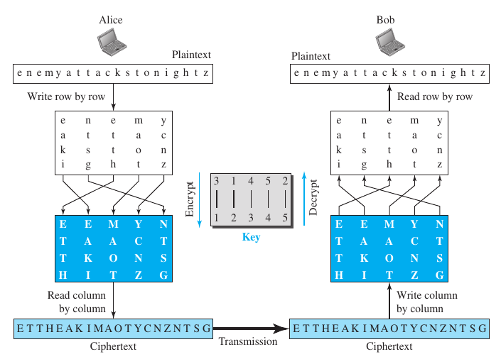
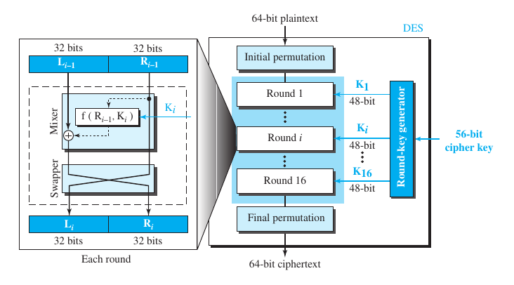
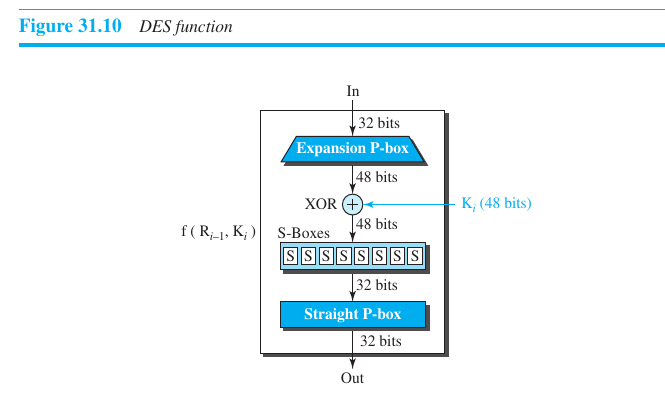

# 9. Cryptography and Network Security

**Security Goals (CIA)**
- confidentiality
	- we need to keep our confidential data safe from anyone accessing them
	- we need to keep our store data safe as well as the confidential data we are transmitting
- integrity
	- our data needs to be changed, updated etc.
	- we have to make sure that the data is changed only through authorized mechanisms and by authorized entities
- availability
	- an authorized entity should be able to access the information, else what use is it

**Attacks**
- security attacks
	- Confidentiality threats
		- snooping 
			- unautharized access/interception of data
			- can be prevented by encryption
		- traffic analysis
			- knowing data that can not be encrypted, like addresses(eg. email address)
	- Integrity threat
		- modification
			- modifying the intercepted data for benifit or just for causing harm
		- masquerading(spoofing)
			- impersonating as someone else (client or server) for data theft/other benifit
		- replaying
			- obtaining a copy of message and resending it again
			- e.g. replaying a transaction
		- repudiation
			- when someone denies sending message
			- suppose, an e payment site tells to pay, but after payment, it denies payment and asks to pay again
	- Availability threat
		- denial of service
			- sending large no. of bogus requests to server that server crashes or slows down due to load
			- or attacker might intersept server's response to client and delete, or delete request from client

**Services and Techniques**
- cryptography
	- making the data secure and immune to attack using one of following mechanisms
		- symmetric key encipherment
		- asymmetric key encipherment
		- hashing
- steganography
	- concealing message itself by covering it with something else

- Symmetric key ciphers
	- what
		- here a single key is used to encrypt the message
		- and the same key is used to decrypt it
		- the key is pre shared b/w sender and reciever through a secure channel
		- cypher, C = Ek(P), plain text, P = Dk(C)
			- E is encryption technique
			- D is decryption technique, reverses of E
	- Traditional symmetric cypher
		- Substitution cypher (substitutes alphabets)
			- mono alphabetic cypher (each alphabet is converted to the same symbol)
				- shift cypher
					- key is no. by which to shift each character
					- eg. "hello" becomes "jgnnq", key is 2
			- polyalphabetic cypher (one alphabet may have multiple symbols throughout text, generally depends on where in text that alphabet is)
				- autokey cypher
					- first key is used to encrypt first character
					- for second character, key is the value of first character
					- for third, key is value of first character
					- and so on
		- Transposition cypher (changes alphabet position)
			- the key tells the mapping of original position to the new position
			- example
				- 
		- stream and block cyphers
			- stream cypher
				- encryption/decryption is done one character at a time
			- block cyhper
				- a block is encrypted/decrypted together using same key
			- combination
				- streams of blocks are encrypted/decrypted

	- Modern symmetric key cyphers
		- modern block cyphers
			- encrypts/decrypts n bit block of plain text at a time
			- components
				- P box (transposes bits)
					- straight P box (retains length)
					- expansion P box (increases length)
					- compression P box (reduces length of text)
				- S box (substitutes bits)
				- XOR box (xor's with key)
				- other components
					- circular shift operation
					- swap operation
					- split
					- combine
			- Data Encryption Standard (DES)
				- 
				- 

- Assymetric key cyphers
	- what
		- here every person has the responsibility of protecting messages that comes to her
		- she creates a public key, that anyone can use to encrypt a message
			- which then can only be decrypted by the private key that only she has
		- so she shares the public key publicly
	- how
		- here the plaintext/cyphertext are seen as integers on which math operations can be performed
		- encryption and decryption functions are different from each other
			- encryption function takes public key and plain text
			- decryption function takes private key and cypher text

	- Which is better
		- this one is generally much slower than the symmetric cypher
		- hence is used to only encrypt small messages
		- this is generally used to share the pre shared key of symmetric syphers

	- RSA Cryptosystem
		- P = plaintext
		- C = cyphertext
		- largeNo1 &  largeNo2 are chosen
		- n = largeNo1 * largeNo2
		- φ = (largeNo1 - 1) * (largeNo2 - 1)
		- publicKey, e & privateKey, d are chosen such that
			- (e * d) % φ = 1
		- now, encryption function becomes
			- C = (Pe) % n
		- and, decryption function becomes
			- P = (Cd) % n

**Other Acpects of Security**
- Message Integrity
	- to protect document from undetected change, it is passed through a hash function and a digest is created.
	- now if changed message is passed through hash function, then the digest is different from the original digest
	- so, now the original digest needs to  be preserved from any change
	- eg. SHA (seecure hash algorithm)

- Message Authentication
	- method 1 (hash method)
		- to check that message is not changed
		- we share a secret key b/w sender and reciever
		- now on sending message we create a message authentication code (MAC) using the secret key and the original message
		- now we send message + MAC
		- on recieving, the MAC is produced again using reciever's secret key, and message and compared with incoming MAC
		- if MAC's are same then integrity of message is maintained
	- method 2 (RSA Digital Signature Scheme)
		- sender has a private key which he uses to create a digital signature using the message and the signing algo
		- and all the recievers have a public key which they use to check if the message is authentic using verifying algo

- Entity Authentication (User authentication)
	- a claiment(one to be verified) and a verifier (one who verifies) need to be online, as this authentication happens in real time
	- verification categories (claimant needs to identify himself to verifiew with )
		- something known (PIN, password, secret key, private key) (remote/online verification)
			- challange response
				- authentication of passwrod without sending password (because it can be stolen on way)
				- verifier sends a challenge
				- which claimant machine solves with the key/password that he types 
				- now the solved piece of data is sent as response
				- which verifier varifies (tries to decrypt with his key)
			- example
				- symmetric key challange response
					- verifier sends a random number
					- claimant has secret key, which he uses to encrypt the random number and send back
					- now verifier tries to decrypt the number with his secret key
				- asymmetric key challange response
					- verfier encrypts a message with claimant's public key
					- claimant decrypts the message with his private key, and sends back the message
					- verifier verifies if recieved message matches the one sent by him
		- something possessed (passport, driver's licence, other id cards)
		- something inherited (fingerprint, voice, facial, retinal characters, handwriting/signature)

