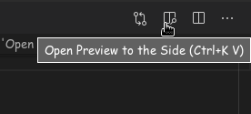
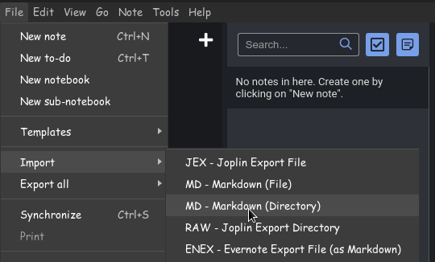

# Computer-Networks-Notes
Contains notes of Data Communication and Data Networking, prepared for semester exams of B.Tech. Note : pull requests are most wellcome.

**Source of Learning : **
- Dr. Srichandan Sobhanayak https://scholar.google.co.in/citations?user=Mu5kdlwAAAAJ&hl=en
- Gate Smashers https://www.youtube.com/playlist?list=PLxCzCOWd7aiGFBD2-2joCpWOLUrDLvVV_

**Instruction for editing notes : **
- with VS code
    - have basic knowledge of markdown rules/syntax
    - you can open the README.md file in vs code and then click on 'Open Preview to the Side' button on top right
        - 

- with Jopline note maker
    - origanally the notes were created using Joplin
    - all notes can be imported by selecting this option
        - 

- with Github
    - just fork and edit

